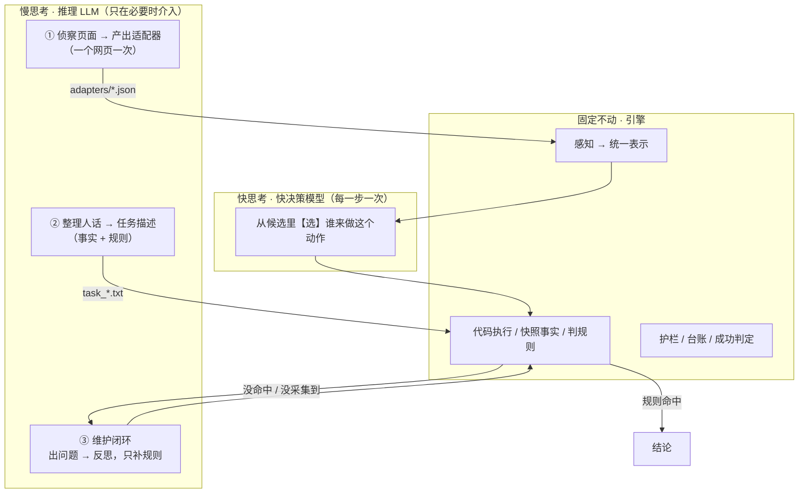

# Jev 启发的快慢双系统操作引擎

> **一句话**：把"操作网页 / 操作系统"这件事拆成 **慢思考**（推理 LLM：侦察页面、写适配器、整理需求）和 **快思考**（快速指令跟随模型：每一步只做一次选择），
> 再用一份**零领域代码**的引擎把两者缝起来。换一个环境 = 换一个适配器 + 改一段自然语言描述，**引擎一行不动**。
>
> 同一份 `general/engine.mjs`：挂 `sitea.json` 跑真实内网后台，挂 `snake.json` 玩网页贪吃蛇 —— **引擎里 grep 不到任何一个领域词**（见 §6）。

---

## 0. 我的思路：这套东西是被三样东西启发的

| 启发 | 拿到了什么 |
|---|---|
| **《思考，快与慢》**（卡尼曼）System 1 / System 2 | 决策不该是一坨连续推理，而该是**一次判断**：从有限选项里带概率地选一个 |
| **Jev**（TypeSafe SystemOne） | 它把"判断力"做成了商品：三种原语（Choice / Noul / Score）、只出决策不出文本、**校准置信度**、按输入计费、输出免费 |
| **人脑结构**（大脑 / 小脑） | 皮层负责慢的、可解释的规划；小脑负责快的、不假思索的技能。**两者底层应该是同一类东西** —— 这直接推出了下面第 2 条判断 |

由此得出四条判断。**这四条是这套东西真正的骨架，代码只是它们的落地。**

### 判断 1 ｜浏览器使用 / 电脑使用，乃至具身智能，不需要一直挂在推理 LLM 上 —— 又浪费又慢

推理模型的成本不在"想得对不对"，而在"它无论如何都要先把话说一遍"。
实测（`jev_deepseek探针报告.md` §2.3）：同一批题，简单题 thinking 只慢 **1.2 倍**，**证据冲突的难题慢 4.6–16 倍、贵 9–31 倍**，一次吐了 **2913 token 的思维链**（11267 字符），
而且**结果还不稳定** —— 三次分别给出 Z / Y / Z（conf 0.5 / 0.45 / 0.65），non-thinking 三次全是 Y@0.45。

> 也就是说：**推理越难，慢和贵的放大倍数越大，而一致性反而更差**。把这种模型放在每一步操作的内环里，是拿最贵的资源去做最琐碎的判断。

再叠加一条本机实测（`jev本机可行性报告.md`）：在无 GPU 的兆芯 KX-7000 上，本地小 LLM 做一次 Jev 式三字段决策要 **1.9–11.9 秒**，
比 Jev 宣称的 70–500 ms 慢 **8–70 倍**（根因是内存带宽只有 **6.4 GB/s**，decode 被带宽锁死）。

**所以内环必须是"快的"，而且必须是"只出决策、不出文本"的。**

### 判断 2 ｜大脑和小脑底层原理同源 → 即使 Jev 不开源，它也应该是神经网络架构 → 用快速指令跟随模型顶替 Jev 是可行的

这条判断的推理链是：

1. 大脑（皮层）和小脑**底层原理应该是相同的** —— 都是神经网络的"输入→判断"；
2. 所以 Jev 那种"System 1 模型"不必是它独门的东西，**它应该就是一个神经网络在做有限选项上的判断**；
3. 那么**一个足够快、足够听指令的通用模型，就应该能顶替 Jev 的位置** —— 不需要等它开源。

**这条判断被实测证实了**（`jev_deepseek探针报告.md`，用 DeepSeek Flash 复刻 Jev 的全部卖点）：

| Jev 的宣称 | 实测结果 | 判定 |
|---|---|---|
| 只出决策不出文本 | 18/18 全是纯净 JSON，零解释性文字 | ✅ |
| 概率分布覆盖全部选项（255 上限） | **60/60 全覆盖、和为 1.00、答案正确**，且没有 255 的坎 | ✅ |
| 并行采样 + 问题隔离 | 一次调用答 6 题，1.58 s，**隔离成立**（q1 / q2 互不污染） | ✅ |
| 校准置信度（RLCD） | 证据阶梯上置信度 **0.875 → 0.80 → 0.65**，方向正确、反证据时行为也正确 | ✅ |
| **70–500 ms** | **地板 611 ms**（36 token 进 / 5 token 出），典型决策 0.72–1.81 s | ❌ **唯一没拿到的** |

> **结论**：Jev 靠 prompt + JSON mode 能拿到的，通用快模型基本都拿到了；**唯一缺的是延迟**，而延迟恰好是判断 1 里那条"内环放到本地"能补的。
> 成本上也不吃亏：1500 token 状态走前缀缓存后 **$0.000110/次**，比 Jev 同 token 量的 $0.000115 **还便宜一点**。

**可交互体验**：`jev控制台.html` —— 单文件、浏览器直接打开，可以自己改情景、改选项、改原语，实时看概率分布、置信度、延迟和花费。
这份控制台就是上面那张表的"手感版"。

### 判断 3 ｜目前实现的闭环：引擎一直不变，适配器适配网页，需求由推理模型整理，快模型决策，出问题推理模型回来维护



四条边界，都是踩坑踩出来的（`通用任务引擎.md` §3）：

- **裁决权在代码，执行权在模型**：规则判定是纯代码对"已冻结事实"做比较，**绝不让模型自由编结论**；模型修不出来就返回「⚠ 无法判定」，**绝不编**。
- **护栏必须由代码做**：实测模型会照指令去点「删除」。
- **事实有时间语义**：必须"在某动作之后定点采集一次并冻结"，否则两个不同步骤读到同一个实时值。
- **台账 / 进度 / 成功判定归代码**：让快模型记计划进度，它会反复重复第一步。

**闭环跑通的证据**（`泛化性验证报告.md`）：

| 证据 | 数字 |
|---|---|
| 同一份引擎跑通 **dom 型**（真实内网后台）| 连续 **3/3** 通过 |
| 同一份引擎跑通 **custom 型**（网页贪吃蛇）| 目标 5 分：**2/3** 达成（得分 10 / 9 / 4） |
| 引擎里领域专有词 | **0 处**（`snake` / `SiteA` / `SiteB` / `memberList` / `贪吃蛇` / `工号` … 全部 grep 为 0） |
| 适配器真的被消费了吗 | 同一页面跑两遍：不挂适配器读出 **52**（数的是侧边栏），挂上读出 **9353**（页面自报），搜完后 **1**（正确） |

> 第 3 行是个很关键的对比：**通用启发式给出的错数看起来完全正常** —— 这就是为什么我们需要"适配器"这一层，而不是让引擎自己去猜页面结构。

### 判断 4 ｜一个提升的例子：贪吃蛇会撞自己 —— 而这只用改描述就能修，不用动代码

**现象**（`泛化性验证报告.md` §3）：3 局实测**全部死于「撞到自己」，一次都没有撞墙**。

**为什么**：模型看到的 `#` 只是"那里有东西"，**没有形状 / 朝向信息**，而且 13 步以外的历史被压缩掉了。
所以它能稳定处理"避开静态障碍 + 朝目标移动"，但**不能可靠推理自己的身体**。这不是 bug，是能力边界。

**而这恰好是"经验可以直接使用"的最好例子**：

- 引擎 `general/engine.mjs` 一行不动；
- 适配器 `general/adapters/snake.json` 一行不动；
- 只改 `general/task_贪吃蛇.txt` 那段自然语言 —— 现在的描述是：

  ```
  【任务】玩一局贪吃蛇，尽量多吃食物，不要撞墙、不要撞到自己。
  ...
  ```

  把"不要撞到自己"从一句**结果要求**展开成**可执行规则**（例如明确给出"下一步会踩到身体就换方向"的判据、
  或者要求先识别蛇头朝向与身体走向、禁止走回头路），**重新跑一次，策略就变了**。

> 这就是整套东西的价值主张：**经验写成自然语言 → 立刻生效**，不需要改代码、不需要重训、不需要改适配器。
> 换一个任务、换一个网页、换一个领域，改的都是**描述**，不是**引擎**。

**诚实的标注**：报告里那 3 局是**当前描述**下的结果。改描述这条路在设计上完全成立（闭环第 ③ 步就是干这个的），
但"改一版描述之后撞自己是否真的消失"**还没有单独验证过一轮** —— 它是我认为最该马上做的一个小实验（见 §9）。

---

## 1. 导览：先看哪个

| 文件 | 是什么 |
|---|---|
| **`README-总览.md`** | 详细总览：结论表、手上有什么、已确定成立的结论 |
| **`general/engine.mjs`** | **引擎本体**（739 行）。感知 / 决策 / 执行 / 事实 / 判定 / 护栏 / 反思都在里面，**跨任务跨领域不变** |
| **`general/adapter.mjs`** | **适配器层**。把任意环境翻译成统一表示 `{stateText, options}`。四件套：状态编码 / 可选项 / 动作执行 / 终止判定 |
| `general/adapters/*.json` | 适配器实例：`sitea.json`（dom 型，纯选择器+正则）、`siteb.json`、`snake.json`（custom 型，带一小段代码） |
| `general/task_*.txt` | **任务描述（自然语言）**。改任务只改这个 |
| `general/browser.mjs` | 常驻浏览器：看得见、登录态长期保留 |
| `general/games/snake.html` | 贪吃蛇测试台（步进驱动、食物随机、可传 `?seed=` 复现） |
| `ops_scenario/mock_*.html` | 两个内网页的等价 mock（6 种分支数据），**不联内网就能跑** |
| **`jev控制台.html`** | **可交互体验页**：亲手看快模型怎么做决策、概率怎么分布、置信度怎么动 |
| `通用任务引擎.md` | 通用引擎的架构、6 分支结果、**7 个踩坑** |
| `泛化性验证报告.md` | ⭐ 最新一轮：泛化性证据、**8 个静默失败**、稳定性数字、诚实的边界 |
| `computer-use方案.md` | 最早的桌面版方案 + 视觉实测（含**分辨率陷阱**） |
| `browser-computer-use方案.md` / `-补充.md` | 收窄到浏览器后的方案 + 两阶段架构的 8 个缺陷 |
| `jev本机可行性报告.md` | 硬件画像、llama.cpp 实测、四种模型 tok/s 与端到端延迟 |
| `jev_deepseek探针报告.md` | 云 API 的延迟 / 花费 / schema / 校准 / 选项规模 |
| `有头浏览器模式.md` | 最小化后是否还能跑的实测 |
| `打包说明与恢复指南.md` | 怎么换设备复现 + **已知未修复缺陷的完整交接** |

---

## 2. 怎么跑

依赖：**Node.js ≥ 22**（要全局 `WebSocket` 和 `fetch`）、Chrome for Testing、
DeepSeek API key（引擎从 `~/.dsh/.credentials.yaml` 读 `DEEPSEEK_API_KEY`）。

```bash
cd general

# ① 完全离线：mock 六分支之一 —— 不需要内网、不需要登录
OPS_MOCK=1 OPS_V=empty_id OPS_DV=ok TASK_FILE="task_账号排查.txt" node engine.mjs

# ② 完全离线：换一个领域 —— 网页贪吃蛇（自动进 loop 模式）
ATTACH=1 CDP_PORT=9240 ADAPTER=snake TASK_FILE="task_贪吃蛇.txt" node engine.mjs

# ③ 适配器被消费的量化对比
node verify_adapter.mjs 10000001
```

体验决策层本身：直接用浏览器打开 **`jev控制台.html`**。

> ⚠️ **本仓库是脱敏公开副本**：内网域名已替换为 `sitea.internal.example` / `siteb.internal.example`（不可解析）。
> "打真实内网"那几条命令需要你换回真实地址并手工登录后才能跑 —— 详见 `打包说明与恢复指南.md` §0。

---

## 3. 实测数字汇总

| 维度 | 数字 |
|---|---|
| 快决策单步（贪吃蛇）| **$0.0001 / 151 ms** |
| 视觉决策（一图四题）| **$0.000039 / 题** |
| 端到端做一个账号排查任务 | 约 **$0.003 / 2 秒**（6 分支里 5 正确、1 诚实弃权、**0 编造**） |
| 复刻 Jev 的 schema 合规 | **18/18** |
| 选项规模 | **60/60** 全覆盖、和为 1.00 |
| 置信度随证据 | **0.875 → 0.80 → 0.65** |
| 云 API 地板延迟 | **611 ms**（绕不开的固定开销 ≈ 0.46 s） |
| 本机（无 GPU）跑小 LLM | **1.9–11.9 s**，比 Jev 慢 **8–70 倍** |
| 本机编码器路线 | **16–50 ms**（有标注数据时准确率可超 Jev） |
| 回归：mock 六分支连跑 25 次 | **23/25 = 92%**（其中失败分支单跑 **16/16**） |
| 回归：真实内网后台 | **3/3** |
| 引擎领域专有代码 | **0 处** |

---

## 4. 诚实的边界（我认为这部分比结论更值钱）

1. **适配器目前是手写的，不是模型生成的。** 这是整条链路里**最大的未验证假设** —— 而它恰恰是"改描述就行"里最难的一环。
   现在格式、消费者、验证手段（`verify_adapter.mjs`）都齐了，所以这件事**终于可以做了**。
2. **规划器 / 抽取器仍不稳定，且失败是间歇的**：同一任务两次拆解不一样（事实编号每次都变），偶尔走进错误分支。
   `checkPlan` 只能拦**结构性**缺陷（词表外的操作符、没人采集的事实、类型不符的元素），**拦不住语义性错误** —— 这是现存第一号缺口。
3. **`plan` 和 `loop` 还是两条代码路径**，没统一；`loop` 目前还不能向输入框填值。
4. **`verify()`（结论复核）是死代码** —— 写了但从没被调用过，**当前所有结论都没有第二道校验**。
5. **贪吃蛇是步进驱动的**，没有实时帧率压力；换成真实游戏 / 驾驶，那个约束还没测过。
6. **盘面只有 10×10**（状态约 250 token）；30×30 会到 ~1000 token/步，成本和延迟都要重估。
7. **真实站点只验了 1 个分支**，其余在 mock 上。
8. **结论复核从来没被调用**这件事本身，就是"引擎成功地做了错误的事、并报告成功"的典型 —— 详见 `泛化性验证报告.md` §5 列出的 **8 个静默失败**。

> 这批静默失败的共同点：**界面看着正常、日志没有报错、结论看起来合理，但结果是错的。**
> 其中一条（`fill` 用 `el.value = x` 会被 React/Vue 的 value setter 覆盖）藏了整轮测试才被抓出来 —— 表现为"搜了工号却得到 9353 条"。

---

## 5. 下一步（按依赖顺序）

| | 做什么 | 为什么排这里 |
|---|---|---|
| **0** ⭐ | **加结构化运行日志**（计划 / 事实 / 命中规则落盘）| 那个间歇性错误结论现在抓不住，就是因为**没有日志** |
| 1 | **统一 `plan` 和 `loop` 两种模式** | 形态应该是：推理 LLM 只产出「事实+规则」，快模型逐步选动作，代码每步后算事实、判规则 |
| 2 | **适配器自动生成** | 补上最大的未验证假设 |
| 3 | **贪吃蛇：只改描述，验证"撞自己"是否消失** | 判断 4 的最小验证，成本极低、证据价值极高 |
| 4 | **接回 `verify()` 并单独验证一轮** | 结论的第二道校验；不要顺手打开，要单独测 |
| 5 | **计划固化 + 缓存** | 同页面第二次跑成本 $0.002 → ~$0.0005 |

---

## 6. 引擎零领域代码（可 grep 复验）

```bash
cd general
for w in snake SNAKE sitea SiteA siteb SiteB memberList ui-table LinkColor 贪吃蛇 工号 邮箱; do
  n=$(grep -c -- "$w" engine.mjs); [ "$n" != "0" ] && echo "$w $n"
done
# 无输出 = 全部 0 处
```

为此专门搬走了两处残留：

| 原来在引擎里 | 现在在哪 |
|---|---|
| 把内网地址换成 mock 页（写死了站点名）| **`mocks.json`**（数据文件，加站点只加一行）|
| 抽取提示词里写死的字段别名举例 | **适配器的 `fieldAliases`**（引擎在调用时注入）|

---

## 7. 脱敏说明

原始研究跑在两个**内网后台网页**上。本副本在发布前做了处理，**方法与全部结论一字未改**：

- 两个内网系统统一称为 **SiteA / SiteB**（代码 id `sitea` / `siteb`）；
- 真实域名 → `sitea.internal.example` / `siteb.internal.example`；内网 IP → `10.0.0.11` / `10.0.0.12`；
- 真实工号 / 姓名 / 邮箱 → 假值；
- **侦察记录已删除**（`recon_*.json` / `recon_*.png` / 运行日志）—— 它们含真实成员列表、真实姓名邮箱与内网页面截图；
- 浏览器 profile 从不入包（含内网 Cookies / Login Data）；无关的第三方参考代码已剔除。

详见 `打包说明与恢复指南.md` §0。

---

## 8. 与 Jev 的关系

| Jev 的能力 | 本项目的实现 |
|---|---|
| Choice / Noul / Score 三种原语 | system prompt 固化，实测 18/18 schema 合规 |
| 校准置信度 | 靠 prompt 拿到了"随证据变化"，但**统计校准（ECE）必须自测** —— 这是唯一能真正验证 / 推翻 Jev 卖点的实验 |
| 255 选项上限 | 实测 60 选项全覆盖、和为 1.00 —— **没有这个坎** |
| 并行采样 + 问题隔离 | 一次调用多题，实测隔离成立 |
| 70–500 ms | ⚠️ **唯一没拿到的**：地板 611 ms。补法是把它本地化（编码器路线 16–50 ms） |

**Jev 卖的是"判断力作为商品"；本项目把它换成了"判断力作为一次调用"，代价是延迟，收益是可改性、可观测、可换环境 —— 而且这套引擎不绑定任何一家模型。**
