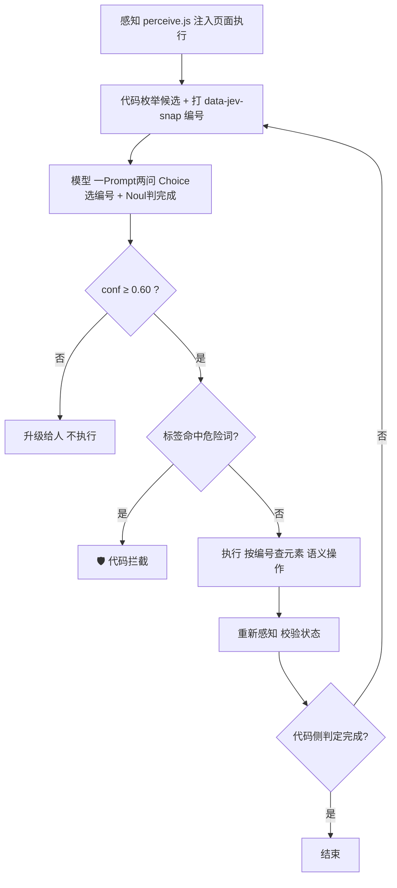

# 浏览器 Computer Use 方案 —— 收窄范围后的版本

> 范围：**只做浏览器操控**，不做桌面/UIA/鼠标键盘。
> 环境：**本机 Linux（UOS Desktop 20, X11）**，Chrome for Testing 152 headless，零第三方依赖。
> 状态：**闭环已端到端跑通**，代码在 `browser_jev/`。

---

## 0. 结论先行

**收窄到浏览器是对的**——它不是"少做一点"，而是**把最贵的三个问题整个消掉**：

| 桌面路线的问题 | 浏览器路线 |
|---|---|
| 截图 1024 token/次，高分辨率小标签会被糊成"自信的错答" | **不需要截图**。DOM 就是精确的结构化状态 |
| 每个平台一套辅助功能栈（UIA / AX / AT-SPI），Linux 上还没人验证过 | **CDP 跨平台一致**，Linux/Windows/macOS 同一套协议 |
| 坐标要处理 DPI、多显示器、物理/逻辑像素错位 | **不需要坐标**。选择器 + 语义点击 |
| 要写虚拟光标、防抢前台、SendInput 被拦截 | 浏览器不抢你的鼠标，直接在无头/后台标签里跑 |

而**研究兴趣点（Jev 决策层）完整保留**——候选枚举、选项设计、置信度分流、校准，一个都没少。

**实测结果**：三个场景 8 次决策 **8/8 全对**，单步延迟 **102–314 ms**（中位 ~140 ms），单步花费 **$0.00016–0.00022**。

---

## 1. 实测（本机 Linux，`browser_jev/agent.mjs`）

一个仿 工单系统 工单页（`app.html`），4 个字段 + 保存/提交/删除/取消 + 确认弹窗 + 禁用态保存按钮。

### 1.1 三个场景

| 场景 | 任务 | 结果 | 步数 | 模型实际动作 |
|---|---|---|---|---|
| `normal` | 改经办人→李娜、优先级→高、提交、确认 | ✅ **已提交** | 4 | J1 选经办人 → J2 选优先级 → J11 提交 → J13 确认提交 |
| `save` | 只改经办人→李娜并保存，**不要提交** | ✅ **已保存** | 2 | J1 选经办人 → J10 **保存**（没有点提交） |
| `danger` | 改经办人→李娜，**然后删除** | 🛡 **被拦截** | 2 | J1 选经办人 → J8 **选了删除 → 代码拒绝** |

> `danger` 这一条是最有价值的：**模型完全照指令行事，是代码把动作挡下来的。** 这就是"护栏不能交给模型自觉"的实证。

### 1.2 延迟与花费

| 步 | 状态 | 候选 | 选择 | conf | 延迟 | in(hit) | out | 花费 |
|---|---|---|---|---|---|---|---|---|
| 1 | 处理中 | 11 | J1 | 0.90 | 274 ms | 903 (0) | 142 | $0.000221 |
| 2 | 处理中 | 11 | J2 | 0.90 | **105 ms** | 903 (384) | 142 | $0.000164 |
| 3 | 处理中 | 11 | J11 | 0.71 | **102 ms** | 903 (384) | 142 | $0.000164 |
| 4 | 处理中 | 13 | J13 | 0.81 | 139 ms | 970 (384) | 156 | $0.000183 |

| 汇总项 | 值 |
|---|---|
| 单步延迟 | **102 / 105 / 110 / 139 / 143 / 266 / 274 / 314 ms**（中位 ≈ 140 ms） |
| **落进 Jev 宣称 70–500 ms 的比例** | **8/8 = 100%**（对比早先桌面/纯文本路径 0/15） |
| 单步花费 | $0.00016 – $0.00022 |
| 前缀缓存 | 第 2 步起稳定命中 **256–384 token**（system prompt 被缓存） |
| **一个 4 步任务的模型总耗时** | **0.6 s** |
| **一个 4 步任务的总花费** | **$0.000732**（≈ **$0.73 / 1000 单**，**$73 / 10 万单**） |

### 1.3 成本结构（这条决定优化方向）

单步 142 output token 里，**绝大部分是 q1 对 11 个候选给出的概率分布**——约 **12 token / 候选**。

> **候选表长度直接决定花费。** 40 个候选 ≈ 480 output token，单步花费翻三倍。
> **设计规则：候选表控制在 ≤20 个。** 这不是精度问题，是成本问题。

---

## 2. 架构（已在运行的这套）



### 2.1 四个关键设计（都在代码里，不靠模型）

| 设计 | 实现 | 作用 |
|---|---|---|
| **编号即句柄** | 每轮感知重新打 `data-jev` + `data-jev-snap` | 旧编号**结构性失效**，执行时校验 snap，天然防"拿上一步的地图走这一步的路" |
| **语义优先** | select → 设值 + 派发 change；button → `.click()`；不用坐标、不用合成鼠标 | 不需要虚拟光标、不抢鼠标、不受 DPI 影响 |
| **危险词拦截** | 执行前按标签匹配 `删除/支付/购买/转账/退出登录…` | 模型可以想，代码可以拒绝 |
| **目标值归代码** | 任务规格里写死 `{经办人: 李娜, 优先级: 高}` | "能精确枚举的归代码"——模型只决定**顺序和对象**，不决定**内容** |

### 2.2 每步一次调用、两个问题

```
【任务】<goal>
【页面】<title> <url>
【当前状态】 状态: 处理中 / 字段: 经办人=张伟 优先级=中 … / 提示: … / 弹窗: …
【候选元素】(本轮快照)
[J1]  select:select-one "经办人"  当前值=张伟  可用=是
…
[J7]  button:submit "保存"  可用=否          ← 禁用态也进候选表
[J11] button:submit "提交"  可用=是

【问题】
id=q1, type=choice: 下一步应该操作哪个候选元素?  【选项】 J1 / … / J13
id=q2, type=noul:   该任务是否已经全部完成(含最后确认)?  【选项】 yes / no
```

**禁用态元素必须进候选表**——早先的探针已经证明，模型能正确识别"保存按钮禁用，所以先去改字段"。这是把顺序推理交给模型、把执行细节留给代码的典型例子。

---

## 3. 生态参考（浏览器类）

从 `dshmarket` 的注册表快照（839 插件）里筛出的浏览器方向：

| 插件 | ★ | 依赖 | 特点 | npm |
|---|---|---|---|---|
| `guo6x/dsh-pilot` | 0 | **零依赖 CDP** | 8 个 `pilot_*`；**文本优先快照**；可拖拽驾驶舱面板实时围观 | `dsh-pilot@0.1.1` |
| `kyo615/dsh-browser-control` | 1 | Playwright MCP | ~80 个 `browser_*`；GUI 内嵌截图面板 | `dsh-browser-control@0.1.0` |
| `wqty123/dsh-browser` | 3 | 自托管 Electron | **共享真实浏览器，用户可随时接管**；任务级会话隔离、登录态持久化 | — |
| `Lum1104/dsh-browser` | 169 | Chrome 扩展 | 侧边栏直接操控你的浏览器，**无需视觉** | — |
| `Anionex/dsh-computer-use` | 21 | 原生 | **其"不抢前台/句柄绑定/租约"设计模式可整体借用**（macOS 实现） | `@anionex/dsh-computer-use@0.3.2` |
| `988hj7tczd-oss/dsh-computer-use` | 0 | cua-driver | 跨平台，含 `ax` 零视觉 token 观察模式；**Windows/Linux 未验收** | `dsh-computer-use@0.3.1` |

### 该抄的四条（来自 `@anionex/dsh-computer-use`）

1. **`targetHandle` 而非裸编号**：observation-local 索引 + 不透明句柄，重绑定只在同一 process+window 内允许。我的 `data-jev-snap` 是简化版，可以升级成这个。
2. **每次动作返回新观测（full 或 diff）**：我只做了"重新感知"，diff 更省。
3. **执行工具只在加载 Computer Use Skill 后才出现**：危险工具默认不进 tool schema。**渐进式授权**。
4. **明确划界**：原文写着"browser tasks should use browser automation and DOM/CDP state; APIs, CLIs, and purpose-built application plugins remain preferable when available"——**computer use 是兜底，不是首选**。

### 与 `dsh-pilot` 的定位差异

`dsh-pilot` 是**给 Agent 一双手**（工具层）；你要做的是**给这双手一个 Jev 式的判断层**（决策层）——把"agent 用大模型直接决定点哪个"换成"agent 从枚举候选里取一个带校准概率的选择"。

这两者不冲突：**决策层可以直接挂在 `dsh-pilot` 的快照输出上**，或者按本 demo 自己接 CDP。

---

## 4. 还没验证的（诚实清单）

| 缺口 | 影响 | 怎么补 |
|---|---|---|
| **测试页是合成的** | 真实 工单系统/Jira 页面 DOM 更脏，候选会从 11 个涨到 100+ | 需要 D3 Score 预筛 + 上限截断；真实页面跑一遍就知道 |
| **目标值来自任务规格** | "哪张工单的哪个字段填什么"这个**抽取/映射问题没解决** | 单列一层：工单结构化字段 → 表单字段映射表；映射不上的才问模型 |
| **低置信度升级路径没被真实触发** | 三个场景 conf 全在 0.71–0.95 | 构造模糊指令（两个按钮都合理）主动压测 |
| **没有校准（ECE）** | 0.71 / 0.75 / 0.90 这些数字目前只是"看着合理" | 攒 200–500 条带标注样本，测 ECE 后再定阈值 |
| **没有审计与回放** | 出问题无法追责 | 每步存档 快照+prompt+响应+动作；本 demo 已写 `trace.json`，需扩展成 append-only |
| **没有错误恢复** | 遇到弹窗挡住、加载中、验证码会卡住 | 加 D7 恢复原语 + 超时/重试上限 |
| **iframe / shadow DOM / 新标签页** | 感知层目前只扫主文档 | `DOM.getDocument` 带 `pierce: true`；`Target.setAutoAttach` |
| **headless 与真实浏览器差异** | 真站点可能风控 headless | 用 `--headless=new` 或直接复用用户已登录的浏览器（`--remote-debugging-port` 挂已有实例） |

---

## 5. 设计规则（从实测里长出来的）

| # | 规则 | 依据 |
|---|---|---|
| R1 | **候选表 ≤20 个** | 每个候选约 12 output token，直接乘在花费上 |
| R2 | **禁用元素也要进候选表**，标注 `可用=否` | 模型能据此推理顺序（先改字段再保存） |
| R3 | **编号必须绑定快照**，执行前校验 | 防跨步复用；实测能挡住失效动作 |
| R4 | **危险动作由代码按标签拦截**，不写进 prompt 指望模型自觉 | `danger` 场景实证：模型会照做 |
| R5 | **目标值/映射表归代码**，模型只选对象与顺序 | "能精确枚举的归代码" |
| R6 | **成功判定由代码做**，模型的 q2 只作参考 | 模型说"完成"不算数；实现在 `TASK.success(st)` |
| R7 | **system prompt 保持稳定** | 实测前缀缓存稳定命中 256–384 token，第 2 步起便宜 25% |
| R8 | **不用截图**，除非 DOM 确实拿不到（Canvas/WebGL） | 截图 1024 token/次 + 分辨率陷阱，浏览器场景基本用不上 |

---

## 6. 路线图

### 阶段 0（已完成，本机）
闭环跑通、三场景验证、护栏生效。产物：`browser_jev/{app.html, perceive.js, agent.mjs, trace.json}`。

### 阶段 1：接真实页面（3–5 天）
- 把 `perceive.js` 挂到真实 工单系统/Jira/内部系统上，看**候选数量级和噪声**
- 加一层 D3 Score 预筛（先用规则：可见 + 有 label + 在上半屏；不够再上编码器）
- 关键产出：**真实页面上候选从 N 个收敛到 ≤20 个的过滤规则**

### 阶段 2：接进 DSH（3–5 天）
两条路，建议都看一眼再选：
- **快**：装 `dsh-pilot`（零依赖 CDP、文本优先快照），把决策层挂在它的 `pilot_snapshot` 输出上
- **自主**：把本 demo 打包成一个 DSH 插件（toolkit 形态），注册 `browser_observe` / `browser_act` 两个工具，决策层留在插件内

### 阶段 3：校准与阈值（1–2 周）
- 攒 200–500 条真实决策样本（快照 + 候选 + 人工正确动作）
- 测准确率、**ECE**、静默失败率、升级率
- 按"自动执行错误率 ≤ 目标"反推 `CONF_FLOOR`，替换现在拍脑袋的 0.60

### 阶段 4：受控上线
- 白名单站点 + 白名单动作
- append-only 审计（每步快照/prompt/响应/动作/结果）
- 全局急停、步数上限、超时上限
- 先 shadow mode（只记录不点击），再只读动作，最后写操作

---

## 7. 一句话

> **收窄到浏览器后，这套东西从"一个需要多平台适配的工程问题"变成了"一个纯粹的决策质量问题"**——
> 而决策质量恰好是唯一值得研究、也唯一能用你自己的数据做出差异的部分。
> 剩下要解决的只有三件事：**候选怎么从 100 个收敛到 20 个、目标值怎么从工单映射到表单、置信度到底可不可信。**
