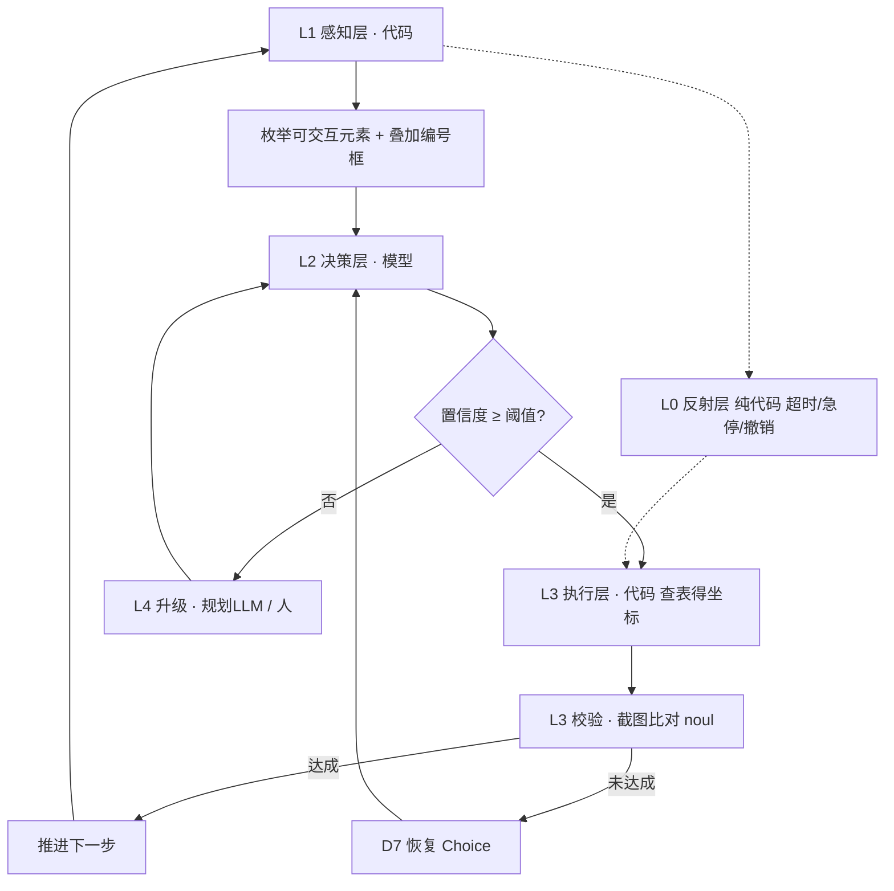

# Computer Use 方案 —— 用 DeepSeek-Jev 模拟做桌面操作

> 全部数字来自本机实测（2026-09-20），脚本与原始数据在工作区：
> `verify_latency.py` / `verify_latency_dist.py` / `verify_console.py` / `verify_vision.py` / `verify_vision_hires.py` / `desktop_mock.png`
> 决策控制台：`jev控制台.html`

---

## 0. 一句话结论

**可行，而且比预期便宜。** 但有一个必须先解决的前置问题、一个必须绕开的陷阱，和一条不能省的验证。

| 判定项 | 结论 |
|---|---|
| 决策质量 | ✅ Choice / Noul / Score 三种原语全部可用，20 选项全覆盖，多题隔离成立 |
| 花费 | ✅ 视觉路径 **$0.000039/题**（一图四题）→ **约 $3.9 / 10 万次决策** |
| 延迟 | ⚠️ 文本 p50 ≈ 0.9 s；视觉 1.1–1.5 s。**快窗口能到 210–395 ms，但不保证** |
| 视觉 grounding | ✅ 编号框方案在 `detail=original` 下 **4/4 全对** |
| **致命陷阱** | ⚠️ `detail:low` 与**高分辨率小标签**都会让模型**自信地答错**（conf 0.80~0.82 却选错） |
| 必须先做 | ❗ **统计校准（ECE）**——置信度是用来分流"自动执行 / 升级给人"的，没测过就不能用 |

---

## 1. 实测数据（本机，off-peak 单价）

### 1.1 延迟：网络不是瓶颈

| 口径 | 结果 |
|---|---|
| TCP+TLS 握手 | 110–290 ms（首连），之后 4–14 ms |
| **TTFB（首字节）** | **95–194 ms** |
| 单次决策总时（curl / python，15 次连打） | min 591 · **p50 923** · max 1193 ms |
| 单次决策总时（页面，一次快窗口） | **210 / 250 / 262 / 285 / 395 ms** |
| 视觉路径（一图一题） | 1288–1412 ms |
| 视觉路径（一图四题） | 1438–1523 ms |

**读法**：`总时 900ms − TTFB 150ms = 750ms` 落在 DeepSeek **服务器侧排队与生成**上，不在跨境链路上。
所以延迟高度依赖当时的服务端负载——**同一台机器同一条链路，实测跨度 210 ms ~ 2470 ms，约 12 倍**。

> **这条决定架构**：不能把"250 ms 内环"当设计前提。要么接受 p50 ≈ 1 s，要么把快路径放到本地。

### 1.2 花费

| 场景 | in | out | $/次 | $/10 万次 |
|---|---|---|---|---|
| 文本 583 tok 决策（热缓存） | 582 | 64 | 0.000069 | $6.9 |
| 文本 1500 tok 状态（热 / 冷） | 2730 | 169 | 0.000110 / 0.000511 | $11 / $51 |
| **视觉：1 图 + 4 题（一次调用）** | 1493 | 200 | **0.000156** | **$3.9**（÷4 题 = $0.000039/题） |
| 视觉：1 图 + 1 题 | 1390 | 99 | 0.000211 | — |
| Jev 同 token 量 | — | — | 0.000024 | $2.4 |

> **视觉路径按"每题"算是 $0.000039**（$0.000156 ÷ 4）→ **约 $3.9 / 10 万次决策**，比文本路径还便宜。

### 1.3 图片的 token 与分辨率

官方规则：图片自动缩放到 **总计约 1300×1300 像素**、**上限 1024 token/张**。
实测：1440×900 图 ≈ **870 token**；2560×1600 图 ≈ **1040 token**。

| 变体 | 结果 | conf | in tokens |
|---|---|---|---|
| 1440×900 · 标签 12px | ✅ C1 | 0.92 | 1374 |
| 2560×1600 · 标签 12px | ❌ **C10** | **0.80** | 1542 |
| 2560×1600 · 标签 22px | ✅ C1 | 0.85 | 1542 |
| 2560 屏 · **裁到内容区 1440×900** | ✅ C1 | **0.95** | **1374** |
| `detail:"low"`（512×512）单题 | ❌ C10（自信错） | 0.82 | 796 |
| `detail:"low"` 四题 | ❌ 全错（C2@0.05，yes@0.5×2） | 0.05–0.5 | 899 |

**两个结论**：
1. **`detail:"low"` 直接禁用** —— 它会把 12px 标签压成 6px，模型看不见却照样给 0.82 的置信度。
2. **编号标签的字号是硬约束**：2560×1600 全屏会被缩到 0.64 倍，标签必须画到 **≥22px**（缩放后 ≈14px）才保得住；或者**裁剪到 ≤170 万像素**，既保准（0.95）又更便宜。

---

## 2. 架构

### 2.1 核心思想

> **代码负责"把可点的东西枚举出来并画上编号"，模型只负责"选哪个编号"。坐标永远不由模型产生。**

这是整套方案的支点。它把 computer use 最脆弱的环节（VLM 回归坐标）换成 Jev 最强的一环（从有限选项里做带概率的选择）。坐标来自 UI Automation 的 `BoundingRectangle`——确定、精确、可复现。



### 2.2 分层职责

| 层 | 谁做 | 内容 |
|---|---|---|
| **L0 反射** | **纯代码，无模型** | 全局急停热键、超时、循环上限、窗口守护、`Esc`/撤销。TerraBlind 的教训：`the brain (LLM) is seconds too slow to react to lava` |
| **L1 感知** | 代码 | 截图 + UIA 枚举 + 过滤 + 编号框叠加 → 一张图 + 一份文本候选表 |
| **L2 决策** | 模型 | Choice / Noul / Score，输出标签与概率 |
| **L3 执行** | 代码 | 标签→UIA 元素→`Invoke` 或物理坐标点击；执行后重新截图比对 |
| **L4 升级** | 模型 / 人 | 低置信、连续失败、不可逆操作 → 规划 LLM 或人工接管 |

---

## 3. 决策原语（把 Jev 映射到桌面操作）

| 编号 | 原语 | 作用 | 例子 |
|---|---|---|---|
| **D1** | Choice | **选目标元素** | 「下一步点哪个框？」选项 = 编号列表 |
| **D2** | Choice | 选动作类型 | 点击 / 双击 / 右键 / 输入 / 滚动 / 拖拽 —— **多数情况可由代码从 UIA 控件类型直接推出，不必问模型** |
| **D3** | Score | 候选相关性 | 从 200 个元素里先筛出 10 个候选（可用编码器降本） |
| **D4** | Noul | 本步是否达成 | 点了下拉框后，列表是否真的展开了？ |
| **D5** | Noul | 整个任务是否完成 | 工单是否已保存成功？ |
| **D6** | Noul | 风险哨兵 | 这一步是否不可逆 / 有副作用？（删除、提交、付款） |
| **D7** | Choice | 失败恢复 | 重试 / 换元素 / 换路径 / 升级给人 |

**不属于 Choice 的**：输入框里填什么文本。那是**抽取**（从工单字段映射），应由代码查表得到；只有在没有明确映射时才交给模型做 Score 或归类。

### 决策 vs 代码的判定线

> **能精确枚举的 → 代码；不能的 → 模型。**

按钮点击一律代码；"这个弹窗是什么意思""该不该点这个看起来危险的东西"交给模型。

---

## 4. 感知层：候选枚举与编号框

### 4.1 候选从哪来

| 来源 | 覆盖 | 说明 |
|---|---|---|
| **UIA 控件树** | 主路径 | `ControlType ∈ {Button, Edit, ComboBox, ListItem, MenuItem, TabItem, CheckBox, Hyperlink, TreeItem}`，且 `IsEnabled && IsOffscreen==False`，面积 > 阈值 |
| **OCR / 视觉补充** | 补漏 | Electron、Canvas、自绘控件 UIA 看不见 → 对截图做文本框检测 |
| **历史缓存** | 兜底 | 上一次成功点击过的元素，在相同窗口标题下优先复用 |

### 4.2 过滤规则（必须有，否则选项爆炸）

1. `IsOffscreen == false` 且 `IsEnabled == true`
2. 面积 ≥ 12×12 物理像素（过滤装饰性元素）
3. 去除父链上已有同语义的重复项（如 button 与它的 text 子节点）
4. **按窗口分组**，只保留前台窗口 + 必要的模态弹窗
5. 上限 **≤ 60 个**（实测 60 个仍全覆盖且正确；Jev 上限 255，但输出 token 会线性涨）

### 4.3 编号框的硬规则

| 规则 | 值 | 依据 |
|---|---|---|
| 标签字号 | **≥ 22 px**（2560×1600 全屏时）；裁剪后可用 14 px | 实测 12px 在 2560 屏被缩放后 → 自信答错 |
| 截图总像素 | **≤ 170 万**（约 1440×900 / 1300×1300） | 官方缩放阈值；超出即开始丢细节 |
| 优先策略 | **裁剪到前台窗口**，而非全屏 | 实测 conf 0.92→**0.95**，token 1542→**1374** |
| `detail` | **永远不设 `low`** | 实测直接导致自信的错答 |
| 叠加方式 | 橙色描边 + 左上角实心标签块，半透明 | 不遮挡原 UI 文字 |

### 4.4 一起送给模型的两种信息

```
[文本候选表]   C1  ComboBox  "经办人"  当前值=张伟
              C2  Button    "保存"    启用=否
              C3  Button    "取消"    启用=是
              C5  Text      "错误: Uncaught TypeError..." 红色
[截图]         同一批元素已画上 C1/C2/C3/C5 编号框
```

文本给**语义与状态**，截图给**视觉上下文与空间关系**。两者互补：UIA 文本精确但缺上下文，截图有上下文但看不清小字。

---

## 5. 调用模式：一图多题

**每一次决策 = 1 张截图 + N 道题 / 1 次调用。**

理由是实测出来的：
- 图片 token（~1040）只付一次
- 同一张图第二题起走**前缀缓存**（实测 `hit=1280`），几乎免费
- 四题一次：**$0.000156**；四题四次：**$0.00084**（5.4 倍）

典型的 N：
| 题 | 类型 | 何时问 |
|---|---|---|
| q1 | D1 Choice 选元素 | 每步必有 |
| q2 | D6 Noul 风险哨兵 | 目标元素是提交/删除/发送类时 |
| q3 | D4 Noul 上一步是否生效 | 上一步执行后 |
| q4 | D5 Noul 任务是否完成 | 每步都问（最便宜的收敛判据） |

---

## 6. 校验与升级：置信度路由

### 6.1 两级门

```
if 确定性前置检查失败 → 直接重采/重试，不调模型
else if conf(D1) < θ_low → 升级给人
else if conf(D1) < θ_high 或 conf(D6) < θ_risk → 执行，但执行后强制校验
else → 自动执行
```

**确定性前置检查**（不花钱、必须最先跑）：
- 选项数 == 画上去的框数？（防编号错位）
- 目标选项是否是当前窗口的前台元素？
- 元素坐标是否在截图范围内？
- 窗口标题/URL 是否还在白名单？

### 6.2 阈值从哪来

**不能拍脑袋。** 必须先在带标注的评测集上测 **ECE（Expected Calibration Error）**，再按"自动执行错误率 ≤ 目标"反推 θ。

在 ECE 测出来之前，**只允许 shadow mode**（只记录决策，不执行）。这是 TerraBlind 的做法：`现在只观测…不改任何行为`。

---

## 7. 实施路线

### 阶段 0：不写自动化，先建评测集（1–2 周）

**这是唯一必须先做的事。** 如果在评测集上连一个简单启发式都打不过，方案的前提就不成立。

- 采集 **200–500 条**真实桌面决策样本：截图 + UIA 候选表 + 正确动作（人工标注）
- 覆盖：工单填写、页面测试、弹窗处理、表单校验失败、加载中、权限不足
- 建立**非模型基线**：
  - B0 随机选
  - B1 规则：优先"提交/保存/下一步"类按钮，其次"输入框"
  - B2 编码器打分（bge-small-zh + 逻辑回归，本机已备好）
- 指标：准确率、**ECE**、**静默失败率**（conf 高但错）、人工接管率

> 判据：**DeepSeek-Jev 必须显著打赢 B1/B2，且 ECE 可用。** 否则先修候选枚举，别急着上模型。

### 阶段 1：shadow mode（1 周）

跑完整循环，**但不真的点击**。只记录：
`截图 → 候选表 → 模型决策 → 置信度 → （人工实际动作）→ 对错`

产出：真实分布下的 θ_low / θ_high 初值。

### 阶段 2：只读任务（1–2 周）

允许执行**无副作用**动作：滚动、切 Tab、展开下拉、选中行、读取字段。
这一阶段能覆盖工单处理的**大部分步骤**，且失败不破坏任何东西。

### 阶段 3：受控写操作（2–3 周）

- 白名单内的写操作（填字段、点保存）
- **每次写操作前必过 D6 风险哨兵**
- 全局急停热键 + 每步截图存档（可回放、可追责）
- 步数上限（如 30 步）+ 时间上限

### 阶段 4：数据飞轮（持续）

每一条 `状态 + 选项 + 决策 + 真实结果` 都在攒一个数据集。攒到 2–5 万条后：
- 用真实 Jev API 当 teacher 蒸馏（$0.042/M 输入、输出免费；10 万条 1500-token 状态 ≈ **$6.3**）
- 训一个本地小模型（kev 路线：Qwen2.5-0.5B/0.6B + LoRA + pointer head）
- **目的不是提精度，是把 p50 从 900 ms 压到 100 ms 以内、把边际成本打到 0**

---

## 8. 技术栈（Windows 侧）

| 用途 | 选型 | 关键坑 |
|---|---|---|
| UI 枚举 | `uiautomation` 或 `pywinauto`（UIA backend） | 必须进程级 **Per-Monitor-V2 DPI aware**，否则拿到的坐标是逻辑像素 |
| 截图 | `mss`（快）或 `PIL.ImageGrab` | 多显示器要按**物理像素**拼，别用逻辑坐标 |
| 输入注入 | `SendInput`（`pydirectinput`）；能用 UIA `Invoke` 就别用坐标点击 | 游戏/UWP/管理员窗口会拦截合成输入 |
| 坐标口径 | **统一用物理像素**，从截图左上角起算 | 与 UIA 的 `BoundingRectangle` 同源，不要混 DPI 缩放 |
| 叠加编号框 | 代码画在截图副本上 | 字号 ≥22px（见 §4.3） |
| 决策通道 | `https://api.deepseek.com/v1/chat/completions` | **复用 HTTP 连接**（省 140 ms）；**不设 `detail:low`** |
| 急停 | 全局热键（如 `Ctrl+Alt+Esc`） | 走独立线程，不经过模型 |

### 环境提醒（你的 Legion R7000）

- 2560×1600 是 **16:10**，全屏截图 410 万像素 → 必被缩放。**默认裁剪到前台窗口**。
- Win11 默认 150% 缩放：截图是物理像素（2560×1600），UIA 坐标若返回逻辑像素会整体错位。**先写一个坐标自检**：在屏幕上点一个已知控件，验证截图坐标与 UIA 坐标一致。
- 8 GB 显存足够本地化后的 0.5B/0.6B 推理；但训练用 WSL2 + cu128。

---

## 9. 成本 / 延迟预算（一次填工单，约 12 步）

| 项 | 值 |
|---|---|
| 决策调用 | 12 次（每步 1 图 + 3 题） |
| 决策花费 | 12 × $0.00012 ≈ **$0.0014 / 单** |
| 决策耗时 | 12 × 1.2 s ≈ **14 s** |
| 1000 单成本 | **≈ $1.4** |
| 1000 单模型耗时 | ≈ 4 小时（可并发，DeepSeek 并发上限 2500） |

对比：用云端 **deepseek-v4-pro** 做同样的事，输入价 $0.66/M 是 Flash 的 4.4 倍，且**不支持视觉** —— 所以 Flash 是这条路线唯一合理的选择。

---

## 10. 风险清单

| 风险 | 严重度 | 对策 |
|---|---|---|
| **高分辨率小标签 → 自信的错答** | 🔴 高 | 标签 ≥22px；裁剪到前台窗口；**永不 `detail:low`** |
| **置信度未校准就用于自动执行** | 🔴 高 | 先测 ECE；未测前只跑 shadow mode |
| 延迟不可预测（210 ms ~ 2.5 s） | 🟠 中 | 设超时与重试；接受 p50≈1s；阶段 4 本地化 |
| UIA 看不到 Electron / Canvas 控件 | 🟠 中 | OCR 补漏；把这类页面降级为"人工 + 模型建议" |
| 不可逆操作被误执行 | 🔴 高 | D6 风险哨兵 + 白名单 + 全局急停 + 每步存档 |
| 坐标口径错（DPI） | 🟠 中 | 启动自检；统一物理像素 |
| 编号错位（选项数与框数不一致） | 🟠 中 | 确定性前置检查，不花钱，最先跑 |
| 窗口/页面变化导致上下文失效 | 🟡 低 | 每步重截图，不做跨步缓存（除系统提示词） |
| 前缀缓存被截图打破 | 🟡 低 | 系统提示词固定不动（实测能稳定命中 256–384 token） |

---

## 11. 与 Jev 的关系（为什么这套值得做）

| Jev 的能力 | 本方案的实现 |
|---|---|
| Choice / Noul / Score 原语 | system prompt 固化，实测 18/18 schema 合规 |
| 校准置信度 | 靠 prompt 拿到了"随证据变化"（证据阶梯 0.875→0.80→0.65），但**统计校准必须自测** |
| 250 选项上限 | 实测 60 选项全覆盖、和=1.00、答案正确 —— 没有这个坎 |
| 并行采样 + 问题隔离 | 一次调用多题，实测隔离成立（q1/q2 互不污染） |
| 70–500 ms | ⚠️ 唯一没拿到的：p50 ≈ 900 ms。**但这恰恰是阶段 4 本地化能补上的** |

**Jev 卖的是"判断力作为商品"；本方案把它换成了"判断力作为一次 API 调用"，代价是延迟，收益是成本、可改性和可观测性——而且顺手把它的视觉短板补上了**（Jev 不是视觉模型，deepseek-flash 是）。

---

## 12. 下一步（三选一）

| 选项 | 工作量 | 产出 |
|---|---|---|
| **A. 先建评测集**（推荐） | 1–2 周 | 200–500 条标注样本 + 非模型基线 + ECE 报告。**这是唯一能证伪整个方案的实验** |
| B. 先写感知层 | 3–5 天 | Windows UIA「截图 + 候选枚举 + 编号框」中间件 + 坐标自检。纯代码，可独立验证 |
| C. 先写循环骨架 | 3–5 天 | shadow mode 跑通：观测→决策→记录，不执行。能立刻看到真实置信度分布 |

**建议顺序：B → A → C。** 先有可靠的候选枚举（B），评测集才有意义（A），有了阈值才敢让循环动（C）。
