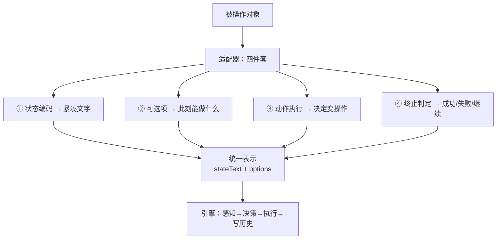

# 泛化性验证报告 · 同一份引擎，两个领域

> 日期 2026-09-20 ｜ 对应改动：`adapter.mjs`（新）+ `engine.mjs`（改）+ `adapters/*.json`

---

## 一句话结论

**同一份 `general/engine.mjs`**，挂 `sitea.json` 跑真实内网后台、挂 `snake.json` 跑网页贪吃蛇，两边都跑通了。
**引擎里没有任何一个领域专有词**（`snake` / `SiteA` / `SiteB` / `memberList` / `ui-table` / `LinkColor` / `贪吃蛇` … 全部 grep 为 0 处）。

**但有一个必须说清楚的前提**：这两个适配器是**推理模型产出的**——这正是本项目的闭环设计（一个网页写一次适配器）。
真正还没做的**不是**"让模型写适配器"（那已经发生了），而是把它**固化成可重复的流程**：
一条命令完成「侦察页面 → 产出 `adapters/*.json` → 自检」，并纳入回归。

---

## 一、统一表示：引擎只认这一样东西



两个适配器形态：

| | `sitea.json`（dom 型） | `snake.json`（custom 型） |
|---|---|---|
| ① 状态 | 页面文字 + 计数规则 | 10×10 盘面 ASCII |
| ② 可选项 | 通用感知从 DOM 里捞出元素 | 上/下/左/右（反向禁用） |
| ③ 执行 | `data-jev` 编号点击/填值 | 调 `window.SNAKE.move()` |
| ④ 判定 | 规则表（代码判） | `over` / `score` |

**dom 型是纯数据**（选择器 + 正则）。**custom 型带一小段代码**——因为游戏/驾驶的状态是高维连续量，没有"元素"可言。代码只出现在**环境这一侧**，引擎里没有。

---

## 二、证据 1：真实 SiteA（dom 型 / plan 模式）

### 适配器真的被消费了吗——同一页面跑两遍

| | 通用启发式（不挂适配器） | 挂 `sitea.json` |
|---|---|---|
| 搜索前结果数 | **52**（数的是侧边栏 `ul>li`） | **9353**（页面自己报的真实总数） |
| 搜 `10000001` 后 | **52**（纹丝不动） | **1**（正确） |
| 认成"数据行"的 | 42 | **22**（= 真实分页封顶数） |

真实 SiteA 页面**一个 `<tr>` 都没有**（`trAll: 0`），是 div 网格。所以通用启发式 `table tbody tr` 数出来的 52 全是侧边栏菜单——**而且这个错数看起来完全正常**。

### 端到端

```
▶ 结论: 工号 10000001 在 SiteA 中存在 → 属于用户自身问题，不是同步问题
▶ 模型 3 次  $0.0009–0.0025  模型耗时 0.63s
```

**连续 3 次全部通过。** 等待策略走适配器声明的防抖轮询（实测 1010–1749ms 稳定）。

---

## 三、证据 2：网页贪吃蛇（custom 型 / loop 模式）

3 局实测（10×10 盘面，食物随机，目标 5 分）：

| 局 | 随机种子 | 得分 | 步数 | 结果 | 成本 | 模型耗时 |
|---|---|---|---|---|---|---|
| 1 | 35749 | **10** | 67 | ✓ 达成 | $0.0066 | 10.15s |
| 2 | 83540 | **9** | 61 | ✓ 达成 | $0.0060 | 7.89s |
| 3 | 28672 | 4 | 30 | ✗ 未达成 | $0.0027 | 4.95s |

**单步成本 ≈ $0.0001，单步延迟 ≈ 151ms。**

`loop` 模式：没有预设动作序列，每一步现感知现决定。这是能泛化到游戏/驾驶的那种形态。

### 一个很清晰的能力边界

> **3 局全部死于「撞到自己」，一次都没有撞墙。**

**但这个诊断后来被推翻了 —— 见 `贪吃蛇策略改进验证.md`。**
把盘面完整打出来就能看到：模型收到的状态里**本来就有** `H`（蛇头）/ `#`（蛇身）/ `F`（食物）的完整网格，
外加"蛇头在第 R 行第 C 列，当前朝 X"。**信息是够的**，缺的并不是"形状 / 朝向"。

8 个种子的 A/B 实测（只改描述、不动代码）给了更准的结论：

- 改描述**改变不了死亡方式**：三个版本的描述 **8/8 全部死于撞自己，0 次撞墙**；
- 但把描述里那条规则**逐字用代码实现**（= 完美执行者），**仍然 8/8 死于撞自己**，一次都没撞墙；
- 而完美执行者的平均分是 **21.6**，是快模型（7.1）的 **3 倍**。

**所以限制有两层，不是一层：**

1. **规则层**：任何"只看一步"的贪心策略，迟早会把自己围死到无路可走 —— 这是**结构性终局**，与谁在执行无关；
2. **执行层**：快模型对同一份规则的**逐步执行保真度**不够（每步要做"行号±1、列号±1、再回表查符号"三次心智运算）。

改描述只能改善第 2 层的一部分（短而机械的描述把平均分从 **7.1** 提到 **9.8**），
治不了第 1 层 —— 那需要更长视野的策略，不是一句描述能给的。

---

## 四、引擎里零领域代码（可 grep 验证）

```bash
cd general
for w in snake SNAKE SiteA sitea siteb SiteB memberList ui-table LinkColor 贪吃蛇 工号 邮箱 ant- biam; do
  n=$(grep -c -- "$w" engine.mjs); [ "$n" != "0" ] && echo "$w $n"
done
# 无输出 = 全部 0 处
```

为此专门搬走了两处残留：

| 原来在引擎里 | 现在在哪 |
|---|---|
| `OPS_MOCK` 把内网地址换成 mock 页（写死 SiteA/SiteB） | **`mocks.json`**（数据文件，加站点只加一行） |
| 抽取提示词里写死的字段别名举例 | **适配器的 `fieldAliases`**（引擎在调用时注入） |

---

## 五、最有价值的部分：被测试逼出来的 8 个「静默失败」

这一轮真正的产出不是"跑通了"，而是**跑通过程中暴露的这些缺陷——它们全都是无声的**：
界面看着正常、日志没有报错、结论看起来合理，但结果是错的。

| # | 缺陷 | 症状（无声在哪） | 修法 |
|---|---|---|---|
| 1 | `fill` 用 `el.value = x` | React/Vue 会覆盖 value setter：**界面看着变了，查询条件没变**。实战中表现为"搜了 10000001 得到 9353" | 用原生 value setter |
| 2 | `evalOp` 不认 `>=` `<=` | 规划器写了 `f1 >= 1`，引擎 `default: return false` → **规则恒为假**，只看到"无法判定" | 补齐 + 操作符归一（`≥`→`>=` 等） |
| 3 | 动作词表不校验 | 规划器写了 `{"do":"snapshot"}`，引擎当成"找元素"白跑一步，**事实永远采不到** | `checkPlan` 静态体检 |
| 4 | 规则依赖的事实没人去 snapshot | 规则**永远不会命中**，但代码不报错 | `checkPlan` 静态体检 |
| 5 | 元素类型不校验 | `fill 搜索框` 选中了**搜索按钮**，设值返回 `OK`，搜索压根没跑 → 走进完全错误的分支（这就是之前"6 分支只对 5 个"的真凶） | `FIT` 白名单：代码限定"只能在这一类里选" |
| 6 | 端口被残留 Chrome 占用 | 静默连上**上一次残留的浏览器**，操作一个陈旧页面 | 端口闸（拒绝启动）+ 进程退出收尸 |
| 7 | `ready.selector` 从没被用过 | 刚启动浏览器后第一次跑，`document.readyState` 已 complete 但数据还没渲染 → **找不到元素** | `waitReady()`，等等适配器声明的就绪元素 |
| 8 | 常驻浏览器偶发卡死 | 直接硬失败，看起来像"脚本坏了" | 自愈：自动重新拉起（登录态在 profile 里） |

**这批缺陷的共同点**：引擎"成功地"做了错误的事，并且报告成功。
第 5 条尤其典型——它藏了整轮测试才被抓出来，因为结论看起来完全合理。

---

## 六、回归基线

| 范围 | 结果 |
|---|---|
| **mock 六分支 · 在最终代码上连跑 25 次** | **23 / 25 = 92%** |
| ├ 其中失败分支 `dup_email` 单独跑 | **16 / 16 = 100%** |
| └ 2 次失败都发生在"5 个分支背靠背连跑"时，都答成「正常」 | **根因未定位**——单独复现不出来 |
| 真实 SiteA 工号存在性（真实内网） | **3 / 3 通过** |
| 贪吃蛇 目标 5 分 | **2 / 3 达成**（得分 10 / 9 / 4） |

**"单次通过"确实不等于"稳定通过"。** 这里有两个数字，都很重要：

- 单独跑一个分支：**16/16**
- 混合连跑：**23/25**

失败是**间歇性、且与负载无关**的（曾在单跑里也复现过一次）。我做了针对性复现（同一分支连跑 8–10 次 + 保留完整日志），**一次都没抓住**，所以根因是未知的，不是"已修好"。

> **这一条的完整交接写在 `打包说明与恢复指南.md` 的「已知未修复缺陷 #1」**——含现象、实测频次、五个未验证假设、以及接手后第一步该做什么（加结构化运行日志）。
> 经决定**本轮不修**，原样交接。

---

## 七、诚实的边界

1. **适配器由推理模型产出，但还没固化成可重复流程。** 闭环是通的（适配器就是模型写的，一个网页一次）；
   缺的是**产品化那一层**：一条命令完成「侦察 → 产出 → 自检」，以及"换一个全新网页能不能稳定一次写对"的回归数据。
2. **规划器/抽取器仍然不稳定**，且**失败是间歇的**：同一任务两次拆解不一样（事实编号都会变），偶尔走进错误分支。`checkPlan` 只能拦住**结构性**缺陷（词表外的操作符、没人采集的事实、类型不符的元素），拦不住**语义性**错误。**这是现存第一号缺口。**
3. **贪吃蛇是步进驱动的**，没有实时压力。真实游戏/驾驶有帧率约束，那个约束还没测过。
4. **盘面只有 10×10**，状态文本约 250 token。换成 30×30 会到 ~1000 token/步，成本和延迟都要重估。
5. **贪吃蛇的死亡几乎全是"撞自己"，极少撞墙**（原 3 局 3/3；8 种子 A/B 共 24 局里 24/24）。
   但根因**不是**"模型不知道自己的身体在哪"——见 `贪吃蛇策略改进验证.md`：
   把规则逐字写成代码的**完美执行者也 8/8 死于把自己围死**。这是"只看一步"的结构性终局。
6. **SiteA 只在真实站点验了 1 个分支**，其余 5 个在 mock 上。
7. **`loop` 模式目前只在 custom 型（贪吃蛇）上跑过**，还没在 dom 型环境上验证。而且**它还不能向输入框填值**——这是统一两种模式时必须补的。
8. **常驻浏览器偶发卡死**，根因未定位（已加自愈，自动重新拉起）。

### 一个额外发现：结论复核从来没被调用

引擎里有一个 `verify()`——设计意图是"拿已冻结的事实复核结论是否自洽"，用的是 `deepseek-v4-pro`。
grep 的结果是：**它只有定义，没有任何调用点。是死代码。**

也就是说，**当前所有结论都没有经过第二道校验**，直接由命中的规则给出。

需要说清楚的是：**接上它也不一定救得了上面那 2 次失败**——那两次是事实本身算错了（结论与错误的事实是自洽的），复核会同意它。
但它能拦住另一类错误：**规则与结论的对应关系写错**（规划器把结论挂到了错误的规则上）。接不接、怎么接，应该单独验证一轮再定。

---

## 八、下一步

按依赖顺序：

1. **统一两种模式**（我认为这是最关键的一步）
   现在 `plan` 和 `loop` 是两条代码路径。你描述的形态其实是二者的合体：
   **推理 LLM 只产出「事实 + 规则」（判定逻辑），快决策模型逐步选动作，代码每步后算事实、判规则。**
   这样裁决权仍在代码、执行权交给快模型，而且 dom 和游戏走**完全一样的循环**。
   统一时顺带要补的：loop 模式要能向输入框填值（现在只能点/按键）。

2. **适配器自动生成**：让推理 LLM 侦察页面 → 产出 `adapters/*.json` → 人工过一眼。
   格式、消费者、验证手段（`verify_adapter.mjs`）现在都齐了，这件事才有意义做。

3. **把间歇性失败钉死**：现在只知道"混合连跑 92%、单独跑 100%"，不知道根因。
   方法：把每次运行的完整计划 + 事实 + 命中规则落盘成结构化日志，失败时可直接 diff。

4. **接回 `verify()` 并验证它**（单独一轮，用已知结论反推）。

5. **计划固化 + 缓存**：同页面第二次跑成本从 $0.002 降到 ~$0.0005。

---

## 附：复现命令

```bash
cd general

# ① 适配器被消费的量化对比（真实 SiteA，跑两遍对比）
node verify_adapter.mjs 10000001

# ② 真实 SiteA 端到端（挂到常驻浏览器，浏览器不在会自动拉起）
ATTACH=1 CDP_PORT=9240 ADAPTER=sitea TASK_FILE="task_sitea工号存在性.txt" node engine.mjs

# ③ 贪吃蛇（自动进 loop 模式）
ATTACH=1 CDP_PORT=9240 ADAPTER=snake TASK_FILE="task_贪吃蛇.txt" node engine.mjs
# 复现同一局：START_URL="file:///.../games/snake.html?seed=35749"

# ④ mock 六分支回归（自带浏览器，不碰常驻那个）
OPS_MOCK=1 OPS_V=dup_email OPS_DV=ok TASK_FILE="task_账号排查.txt" node engine.mjs
```
