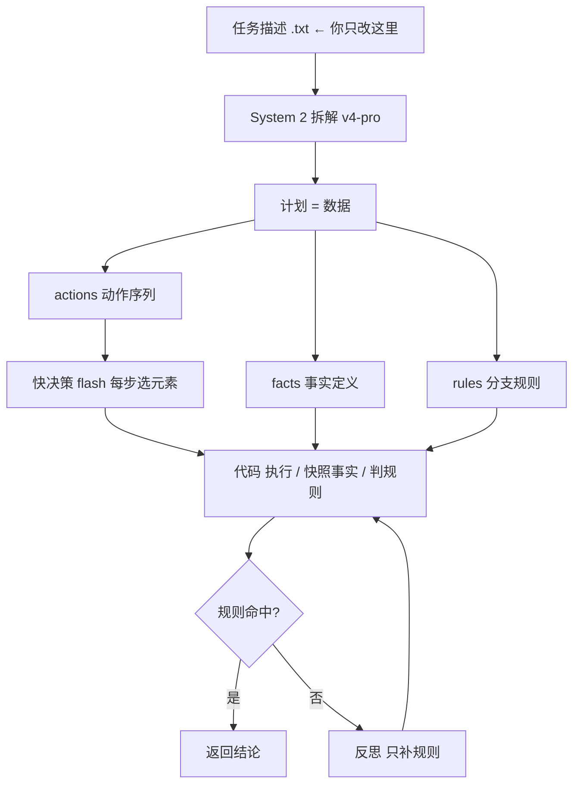

# 通用任务执行引擎 —— 描述驱动，不改代码

> 回答："我希望的是泛化的流程，将操作给推理 llm，推理 llm 分析拆解给快决策+浏览器操作，
> 然后在总结过错形成闭环，之后有类似任务只需改描述就行。"
>
> **建出来了，跑通了。** 代码在 `general/`：`engine.mjs`（固定引擎）+ `task_*.txt`（描述）。

---

## 1. 架构：什么固定、什么变化



**固定的（跨任务不变，写一次）**
- 感知：`perceive.js`（页面 → 状态 + 候选元素，带 `ctx` 所在行 / `zone` 面板标识）
- 决策：快模型在候选里**选**谁来完成某个动作（**界面变了也不用改代码**）
- 执行：按编号点击/填值/选择（语义优先，不用坐标）
- 事实：`rowCount`（代码）/ `extract`（模型抽取）/ `sameName`（模型判断）/ `today`（代码）
- 判定：`> < == != isEmpty isToday contains` —— **纯代码**
- 护栏：危险词拦截、快照失效检测、界面变化检测

**变化的（你只改这一段自然语言）**
```
【任务】排查一个"账号未同步"问题。
用户信息：姓名 张三，工号 123，邮箱 123@123.com
第一步，打开 SiteA… 在搜索框输入工号 123，看结果条数。
  如果结果条数 > 0 → 结论「用户自身问题」，结束。
  …
```

**被拆出来的"数据"**（以实测某次拆解为例）
```
事实 : f1(rowCount) f2(rowCount) f3(extract:工号) f4(extract:姓名) f5(extract:邮箱)
       f6(extract:信息更新时间) f7(sameName) f8(today)
规则 : r1 if f1 > 0         → 用户自身问题              [终止]
       r2 if f1 == 0        → 进入第二步（继续搜邮箱）
       r3 if f3 isEmpty     → 问题1：工号为空            [终止]
       r4 if f7 == false    → 问题2：邮箱重名            [终止]
       r5 if f5 != "123@…"  → 问题3：邮箱还未更新        [终止]
       r6 if f8 isToday     → 正常：等明天再看           [终止]
动作 : goto → fill 搜索框 = 123 → click 搜索按钮 → [snapshot f1]
       fill 搜索框 = 123@123.com [unless r1] → click 搜索按钮 [unless r1] → [snapshot f2]
       click 查看详情按钮 [unless r1] → [snapshot f3,f4,f7]
       …
```

---

## 2. 实测结果

### 任务一：账号排查（同一份 `engine.mjs`，只换描述）

| 分支 | 期望 | 实际 | 模型调用 | 花费 |
|---|---|---|---|---|
| A 工号搜得到 | 用户自身问题 | ✅ **用户自身问题** | 4 次 | $0.0033 |
| B 邮箱搜到·工号为空 | 问题1 | ✅ **问题1** | 9 次 | $0.0027 |
| C 邮箱搜到·是别人 | 问题2 | ⚠ **无法判定**（未编结论） | 13 次 | $0.0045 |
| D 两边没有·SiteB 邮箱对且今天 | 正常 | ✅ **正常** | 12 次 | $0.0031 |
| E 两边没有·SiteB 邮箱不对 | 问题3 | ✅ **问题3** | 12 次 | $0.0032 |
| F 邮箱对但更新时间不是今天 | 异常 | ✅ **异常** | 12 次 | $0.0034 |

**5/6 正确，1 个诚实弃权，0 个编造。** 单次约 **$0.003 / 2 秒**。

### 任务二：只看用户信息（**不需要任何前置步骤**）

同一份引擎，只把描述换成：

```
【任务】查一下工号 123 这个用户的账号信息，把姓名、邮箱、信息更新时间报给我。
不需要任何前置检查，不需要打开 SiteA。
打开 SiteB… 点「登陆」→ 选用户名 → 输入工号 → 确定 → 点「详情」
读出「姓名」「邮箱」「信息更新时间」，直接返回，结束。
```

```
动作 : 6 步   ← 计划自动只有 6 步，完全跳过了 SiteA
✅ 命中规则 r1: 姓名：{{f1}}，邮箱：{{f2}}，信息更新时间：{{f3}}
▶ 结论: 姓名：张三，邮箱：123@123.com，信息更新时间：2026-09-20 09:12
▶ 模型 8 次  $0.0013
```

**这证明了你要的两件事**：只改描述 ✅、不需要前置步骤 ✅、界面由模型现场找所以改版不炸 ✅。

---

## 3. 跑通过程中踩到的 7 个坑（这是最值钱的部分）

| # | 坑 | 症状 | 修法 |
|---|---|---|---|
| **1** | **事实有时间语义** | `f1`(搜工号后条数) 和 `f2`(搜邮箱后条数) 都从实时 DOM 读，读到同一个值 → 邮箱分支命中了「工号存在」 | 计划的每个动作带 **`snapshot:["f1"]`**，事实**定点采集一次后冻结** |
| **2** | **规则要在"事实就绪"后才能判** | 面板还没打开，`工号` 抽取返回 null → 被当成"空"→ 直接命中「问题1」 | 抽取器返回 `found`；**字段没出现在页面上 → 该事实未就绪 → 引用它的规则不判** |
| **3** | **`pageText` 取到了隐藏的弹窗** | SiteB 页第一个 `[role=dialog]` 是隐藏的登录框 → `innerText` 是空串 → 邮箱/更新时间全抽不到 | 只取**可见**的对话框，取最上层那个 |
| **4** | **"字段在但值为空" ≠ "字段不存在"** | 工号为空被判成"页面上没有工号字段" | 抽取器 prompt 明确区分这两种，`found:true, value:""` |
| **5** | **对抗式复核会制造假阳性** | 我写"事实里若有能推翻它的证据必须改判" → 它把一个**正确的**「正常」改成了「异常」 | 改成中性："**只有事实与结论明确矛盾时才改判；无法确认时保持原结论**" |
| **6** | **绝不能让它自由编结论** | 复核员直接输出一个自由文本结论，压过了规则判定 | 改成 **"只补规则"**：反思只产出 rules，**判定仍由代码对已冻结事实做**；修不出来就返回「⚠ 无法判定」，**绝不编** |
| **7** | **关键词式完整性校验是假阳性机器** | 用 6 字窗口比对，规划器只是改写了措辞 → 每次都误报"漏了 3 条结论"，白烧 3 次拆解 | 换成**一次语义校验调用** |

另外补的：**`{{fN}}` 占位符替换**（否则结论原样输出 `姓名：{{f1}}`）。

---

## 4. 现在的可靠性瓶颈在哪

**不在执行层 —— 执行层已经全对。**

| 层 | 状态 |
|---|---|
| 感知（找元素、带行上下文） | ✅ 每次选中率 100%，conf 0.90–0.97 |
| 执行（点击/填值/选择） | ✅ 全对 |
| 事实（快照/冻结/就绪门控） | ✅ 修完后正确 |
| 规则判定（代码） | ✅ 确定、可复现 |
| **拆解（System 2 出计划）** | ⚠️ **每次跑都不完全一样**，会漏规则、会误用 `stop` |
| **反思（补规则）** | ⚠️ 能救回一部分，但救不回"从来没采集到的事实" |

C 分支那次失败的证据很清楚——事实表显示 `f2=0`，但 dup_email 变体下搜邮箱应该有 1 条命中：
**计划这次没把 `snapshot f2` 放在第二次点搜索之后**，所以那个事实从来没被采集，后面的规则自然判不了。

**换句话说：错在"计划"，不在"执行"。**

---

## 5. 下一步该做的三件事

| 优先级 | 做什么 | 为什么 |
|---|---|---|
| 🔴 **1** | **计划固化 + 缓存** | 第一次拆对了就按 `(页面指纹 + 任务指纹)` 存成 JSON；之后**按同一份计划执行**。这样"只改描述"仍然成立，但执行变成**确定的、可复现的**。这也顺便让成本从 $0.003/次 降到 $0.0005/次。 |
| 🔴 **2** | **建真值集 + 脚本化回归** | 现在 6 个分支我是手工跑的。把它变成 `run_all.sh`，每次改 prompt / 改描述都跑一遍，输出通过率。**没有这个，任何优化都是赌。** |
| 🟠 **3** | **描述的写法规范** | 实测描述写得好坏直接决定拆解质量。规则：① 每个结局用「」引号包完整句子 ② 结尾明确写"结束" ③ 每个分支都写全（我第一次给你的描述就漏了两个分支）④ 数值和标签原样写 |

**还有一件要提醒你的**：C 那次返回的是「⚠ 无法判定」，**这是对的行为**。做运维结论时，**报"我不确定，请你人工看一下"远好过报一个编出来的结论**。这也是我把自由复核整段删掉的原因。

---

## 6. 怎么用

```bash
cd general
# 改描述
vi task_账号排查.txt

# 本地 mock 跑（不需要内网）
OPS_MOCK=1 OPS_V=dup_email OPS_DV=ok TASK_FILE="task_账号排查.txt" node engine.mjs

# 接真实内网：去掉 OPS_MOCK，描述里直接写真实 URL
TASK_FILE="task_账号排查.txt" node engine.mjs
```

`OPS_V` / `OPS_DV` 只是 mock 的变体开关；**接真实站点时把 `OPS_MOCK` 去掉、描述里的 URL 已是真实地址**。

## 7. 文件

| 文件 | 作用 |
|---|---|
| `general/engine.mjs` | **固定引擎**（感知/决策/执行/事实/判定/护栏/反思） |
| `general/task_账号排查.txt` | 任务一描述（你原来的流程，两个空洞已补） |
| `general/task_只看用户信息.txt` | 任务二描述（无前置步骤） |
| `ops_scenario/mock_sitea.html` `mock_siteb.html` | 两个内网页的等价 mock（4+3 种分支数据） |
